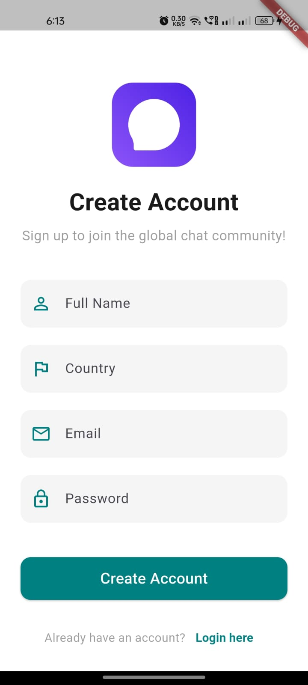
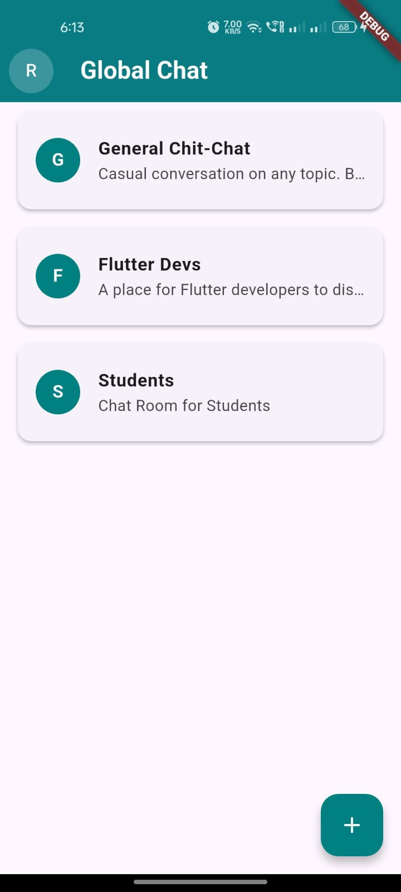
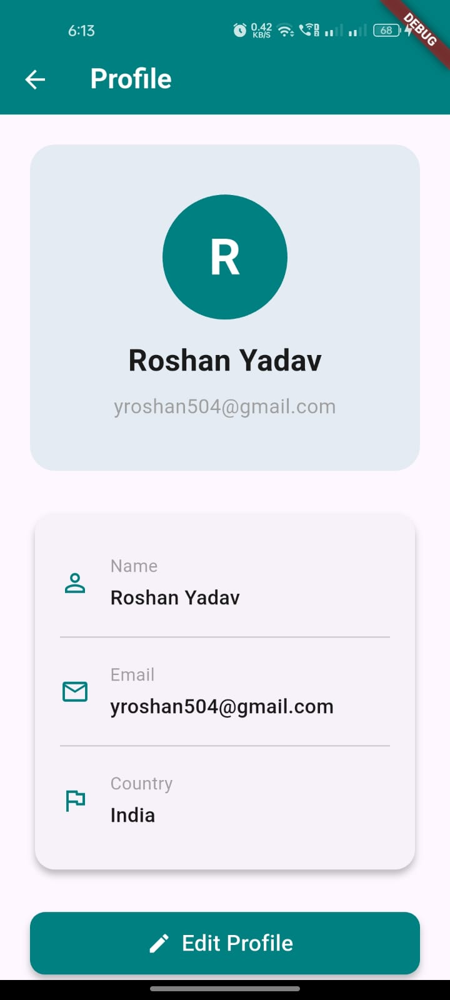
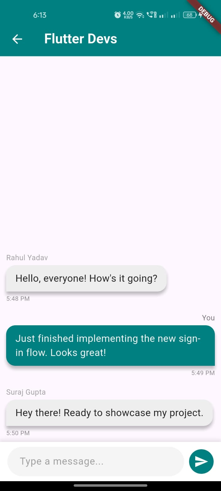

# 🌍 Global Chat App

A real-time chat application built with **Flutter** and **Firebase**. This project demonstrates a clean architecture, real-time data synchronization, and a modern, user-friendly interface.

---

## ✨ Features

- **Real-time Messaging**: Instantly send and receive messages in public chat rooms.
- **User Authentication**: Secure sign-up and sign-in using Firebase Auth.
- **Dynamic Chat Rooms**: Users can create and join public chat rooms.
- **User Profile Management**: Edit your display name and view your profile.
- **Provider State Management**: Manages the application's state efficiently using the Provider package.
- **Clean UI**: A modern, responsive design with a cohesive color palette.

---

## 📸 Screenshots

| Sign Up Screen | Chat Room List |
|--------------|----------------|-------------|
|  |  |

| Profile Screen | Chat Screen |
|----------------|------------------|
|  |  |


---

## 🛠️ Tech Stack

- **Flutter**: The UI framework for building beautiful, natively compiled applications from a single codebase.
- **Dart**: The programming language for Flutter.
- **Firebase**: The backend-as-a-service platform used for:
    - **Firestore**: A flexible, scalable database for real-time data storage.
    - **Authentication**: To handle user sign-up and login.

---

## 🚀 Getting Started

Follow these steps to set up and run the project locally.

### Prerequisites

- [Flutter SDK](https://flutter.dev/docs/get-started/install)
- [Firebase account](https://firebase.google.com/)
- An Android/iOS emulator or Chrome for web

### Installation

1. **Clone the repository:**
    ```bash
    git clone https://github.com/Roshan-504/Global-Chat-App.git
    cd Global-Chat-App
    ```
2. **Set up Firebase:**
    - Create a new Firebase project in the Firebase Console.
    - Create a Firestore database and set up the `users`, `chatrooms`, and `messages` collections.
    - Enable Firebase Authentication with Email/Password sign-in.
    - Add a new Android, iOS, or Web app to your Firebase project and follow the on-screen instructions to download the `google-services.json` (for Android) or `GoogleService-Info.plist` (for iOS) file and place it in the correct directory.
3. **Install dependencies:**
    ```bash
    flutter pub get
    ```
4. **Run the app:**
    ```bash
    flutter run
    ```

